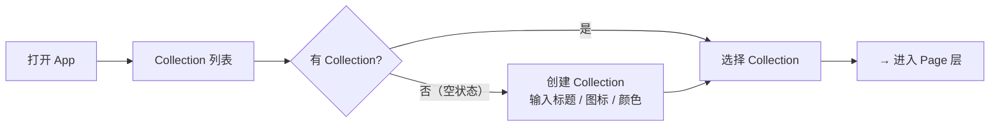
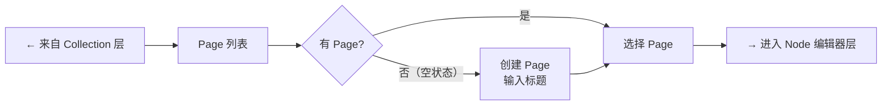
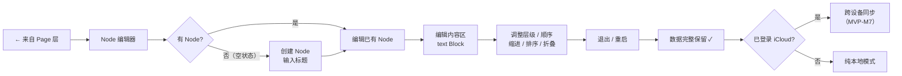

# Notte 核心用户旅程

**Milestone** M0 · Definition  
**Version** v1.0  
**状态** 草稿  
**适用范围** MVP 主路径（iPhone，Local-first）

---

## 一、主路径总览

```
打开 App
  └─ Collection 列表（空状态 / 已有内容）
       └─ 创建 Collection（标题 + 图标 + 颜色）
            └─ 进入 Collection → Page 列表（空状态）
                 └─ 创建 Page（输入标题）
                      └─ 进入 Page → Node 编辑器（空状态）
                           └─ 创建第一个 Node（输入标题）
                                └─ 编辑 Node 内容区（text Block）
                                     └─ 调整 Node 层级 / 顺序
                                          └─ 退出 / 重启 → 数据完整保留  ← Local-first 闭环
                                               └─ （可选）iCloud 跨设备同步
```

---

## 二、主路径流程图

### 图 1：Collection 层



### 图 2：Page 层



### 图 3：Node 编辑器层



---

## 三、步骤叙述表

### 3.1 Collection 层

| # | 用户所在位置 | 用户行为 | 系统响应 | 成功条件 |
|---|---|---|---|---|
| 1 | 启动 App | 打开应用 | 显示 Collection 列表主屏；若无数据则显示空状态引导 | 首屏在 1s 内呈现 |
| 2 | Collection 列表（空状态） | 点击「创建 Collection」 | 弹出创建表单（标题输入框、emoji 图标选择、颜色选择） | 表单正确呈现 |
| 3 | 创建表单 | 输入标题，选择图标与颜色，确认 | 新 Collection 卡片出现在列表；`sortIndex` 自动分配 | Collection 写入 SwiftData，重启后依然存在 |
| 4 | Collection 列表 | 长按拖动卡片 | 卡片跟手移动，释放后 `sortIndex` 更新 | 排序结果持久化 |
| 5 | Collection 列表 | 点击固定（Pin） | Collection 移到列表顶部固定区域 | `isPinned = true`，重启后位置不变 |
| 6 | Collection 列表 | 滑动删除某个 Collection | 弹出确认对话框（说明级联删除影响） | 确认后 Collection 及其所有 Page / Node / Block 全部清除 |

---

### 3.2 Page 层

| # | 用户所在位置 | 用户行为 | 系统响应 | 成功条件 |
|---|---|---|---|---|
| 7 | Collection 列表 | 点击某个 Collection | 跳转到该 Collection 的 Page 列表；若无 Page 显示空状态 | 导航正确，页面标题显示 Collection 名称 |
| 8 | Page 列表（空状态） | 点击「创建 Page」 | 弹出标题输入框 | 输入框自动聚焦 |
| 9 | 创建 Page 表单 | 输入标题，确认 | 新 Page 行出现在列表，显示标题和创建时间 | Page 写入 SwiftData，`collectionID` 正确关联 |
| 10 | Page 列表 | 长按拖动 Page 行 | Page 行跟手，释放后 `sortIndex` 更新 | 排序持久化 |
| 11 | Page 列表 | 滑动归档某个 Page | Page 从主列表消失，可在归档区查看 | `isArchived = true`，不影响其他 Page |
| 12 | Page 列表 | 滑动删除某个 Page | 弹出确认对话框 | 确认后 Page 及其所有 Node / Block 清除 |

---

### 3.3 Node 编辑器层

| # | 用户所在位置 | 用户行为 | 系统响应 | 成功条件 |
|---|---|---|---|---|
| 13 | Page 列表 | 点击某个 Page | 跳转到 Node 编辑器；若无 Node 显示空状态提示 | 导航正确，编辑器标题显示 Page 名称 |
| 14 | Node 编辑器（空状态） | 点击空状态区域 / 点击「+」 | 创建第一个 Node，光标自动聚焦到标题输入框 | Node 写入，`pageID` 正确，`depth = 0` |
| 15 | Node 标题输入框 | 按回车 | 在当前 Node 下方插入同级新 Node，光标自动跳转 | 新 Node `sortIndex` 正确，焦点移到新 Node |
| 16 | 空 Node 标题输入框 | 按退格 | 删除当前空 Node，光标跳转到上一 Node 末尾 | 空 Node 清除，焦点位置正确 |
| 17 | Node 标题输入框 | 按 Tab | 当前 Node `depth + 1`（缩进加深），成为上一 Node 的子节点 | `depth` 更新，视觉缩进正确，`parentNodeID` 正确 |
| 18 | Node 标题输入框 | 按 Shift + Tab | 当前 Node `depth - 1`（缩进减少），depth 最小为 0 | `depth` 更新，`parentNodeID` 更新，视觉正确 |
| 19 | Node 列表 | 点击展开/折叠按钮 | 收起或展开该 Node 的子树 | `isCollapsed` 状态持久化，重启后保持 |
| 20 | Node 列表 | 长按拖动某个 Node | Node 行跟手移动，释放后 `sortIndex` 更新 | 排序结果持久化，子节点随父节点一起移动 |
| 21 | Node 列表 | 点击某个 Node 展开内容区 | 显示该 Node 的 Block 列表（文字内容区） | 内容区正确渲染 |
| 22 | Node 内容区 | 输入文字 | 实时写入 text Block，自动保存 | 无需手动保存，退出后内容不丢失 |
| 23 | Node 列表 | 滑动删除某个 Node | 弹出确认对话框（说明子节点一并删除） | 确认后 Node 及其子 Node 与 Block 全部清除 |

---

### 3.4 持久化与同步层

| # | 用户所在位置 | 用户行为 | 系统响应 | 成功条件 |
|---|---|---|---|---|
| 24 | 任意编辑中 | 按 Home 键退出 App | 自动保存所有未保存更改 | 无数据丢失 |
| 25 | 任意位置 | 强制退出后重新打开 App | 所有 Collection / Page / Node / Block 数据完整呈现 | Local-first 闭环验证通过 |
| 26 | 已登录 iCloud 的设备 | 在设备 A 编辑后切换至设备 B | 设备 B 在网络恢复后同步最新数据（M7 后启用） | 同步完成，数据一致 |
| 27 | 离线状态 | 无网络下正常使用 | 本地编辑全部正常，无任何功能降级 | App 在无网络时功能完整 |
| 28 | 未登录 iCloud | 使用任意功能 | 纯本地模式，iCloud 相关入口隐藏或降级提示 | 本地模式下主路径全部可用 |

---

### 3.5 Onboarding 层（M6）

| # | 用户所在位置 | 用户行为 | 系统响应 | 成功条件 |
|---|---|---|---|---|
| 29 | 首次安装启动 | 打开 App | 显示不超过 3 步的引导页，解释 Collection / Page / Node 核心模型 | 用户能理解核心结构后进入主界面 |
| 30 | 引导完成后 / 空 Collection 列表 | 点击「导入示例数据」 | 导入一套完整示例 Collection，包含示例 Page 和 Node | 示例数据完整显示，可正常浏览和编辑 |

---

## 四、核心异常路径

| 场景 | 预期行为 |
|---|---|
| iCloud 同步失败 | 本地数据不受影响，显示基础错误提示，不阻断主路径 |
| 删除有子 Node 的 Node | 触发确认对话框，明确告知子节点将一并删除 |
| 删除有 Page 的 Collection | 触发确认对话框，明确告知所有 Page / Node / Block 将级联删除 |
| `sortIndex` 冲突 | 后台定期 normalize，用户无感知 |
| 首次使用无引导 | 空状态提供明确的行动引导，不出现白屏 |

---

## 五、范围说明

本文档描述的是 **MVP 主路径**，以下场景明确不在此旅程内：

- AI 功能
- 协作与多人编辑
- 模板市场与分享
- Map View（思维导图视图）
- 非 text 类型 Block（bullet / image / code）
- 全局搜索
- 复杂导出（PDF、图片）
- iPad 双栏布局 / macOS 多窗口

---

> **一条主线，始终不变：**
>
> ```
> Collection → Page → Node → Block
> ```
>
> 任何不在这条链路上的能力，都不进入 MVP。
